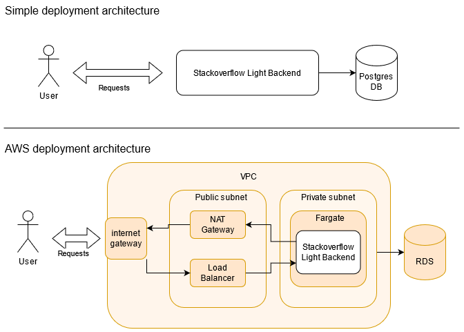

# Stackoverflow Light

The project aims to give users a platform to ask all their important questions and receive helpful answers from the community!

The project is written in Typescript, using Express.js as a web framework. The underlying data store should be PostgreSQL-compatible.

## Running the project

The easiest way run the project is with a local Docker installation.

First, set up a local `.env` file with the necessary variables. An example:

```
JWT_SECRET=*Signing secret for JWT tokens*
JWT_ALGO=*Algorithm for JWT signing, e.g. RS256*
PGUSER=postgres
PGPASSWORD=postgres
PGHOST=database
PGDATABASE=solight
PGPORT=5432
```

The `PG` (PostgreSQL) variables should have these values when using the Docker Compose file. Running

```
docker-compose up
```

should build and containerize the project, run the necessary database and the backend.

Any way of running the project will always depend on the aforementioned environment variables, so make sure they are set correctly.

## Using the backend

The backend runs an HTTP REST API on port 8080. The API is described by `openapi.json`, but is also hosted by the backend itself in a Swagger UI. This can be found on the `/api-docs` path, e.g. [`http://localhost:8080/api-docs`](http://localhost:8080/api-docs).

## Backend architecture

A run-down of the chosen technologies and reasoning:

-   I opted for Node.js and Typescript since I am most comfortable with those.
-   I chose Express.js since I have some experience with it and it has a good adoption rate.
-   I chose PostgreSQL since the stored data is very structured and it seemed the most default choice for an SQL implementation.
-   I chose default JWT for authentication since it is simple to use in a project and a very well-know standard.

The project is split in two main parts:

-   An express API, which accepts the user requests, handles authentication and calls the necessary methods on the Database Wrapper.
-   A Database Wrapper, which contains all the logic to interact with the backing PostgreSQL database. The abstracts away the PostgreSQL-specific logic, making it easier to switch to a different data store if necessary.

Since the code itself is fairly limited in size, no overly aggressive splitting has been performed. This may make the Database Wrapper a bit loaded.

## Deployment of the backend

The backend is provided as a buildable docker container. This makes it easy to run on any cloud provider, given the necessary database infrastructure is available.

The backend is stateless, so trouble with scaling and data inconsitencies are reduced to a minimum.

An AWS example: Set up an RDS instance compatible with PostgreSQL, deploy the project on Fargate. Setting this up correctly in a VPC with a public subnet to balance the traffic allows protection of the application from the outside and improves scalability and transparency of rolling upgrades. Design based on [AWS blog post](https://aws.amazon.com/blogs/compute/task-networking-in-aws-fargate/).



## Omitted work

-   Correct error handling on all routes. Currently the Backend might exit when faulty calls are performed. An example of a route with correct error handling is `GET` on `/questions/:id`.
-   The nice-to-have involving live updates. I would assume this involves WebSockets but I don't have any experience with that topic.
-   Using an OpenID Connect provider turned out to be more confusing than expected and I lost some time on trying that out. I opted to replace it with Bearer token logic and verification on the necessary routes.
-   Currently, user registration and question attribution is not implemented. It seemed not strictly necessary for the assignment so I made only the necessary effort for the metrics logic.
-   Adding an extra API identifier to stored objects. Currently, the database primary key of objects is exposed to the public, which is not necessarily very clean.
-   Adding unit tests for all logic. I added some as an example of my testing and mocking strategies, which should cover enough versatile scenarios.
-   Documenting the code itself. The code is small and simple enough to understand at a glance, but in a real-world situation I would add some JSDoc style comments where necessary/applicable.
